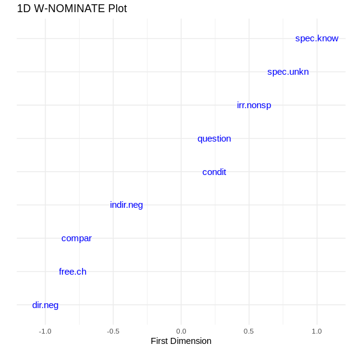
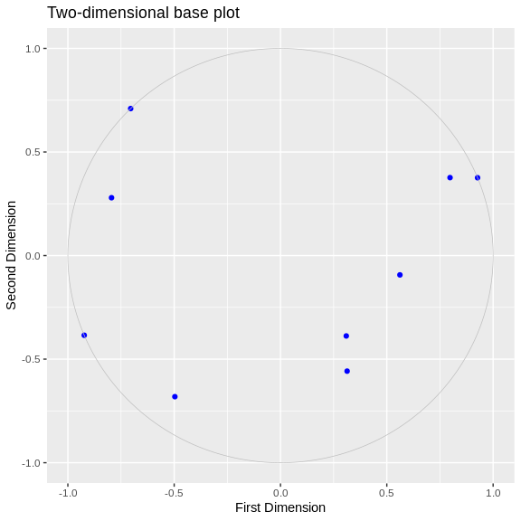
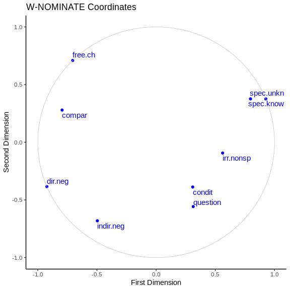
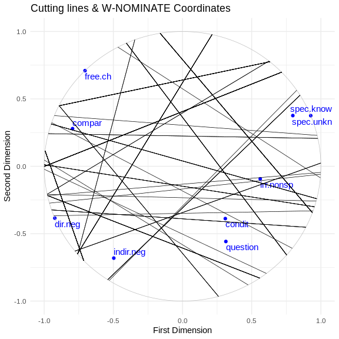
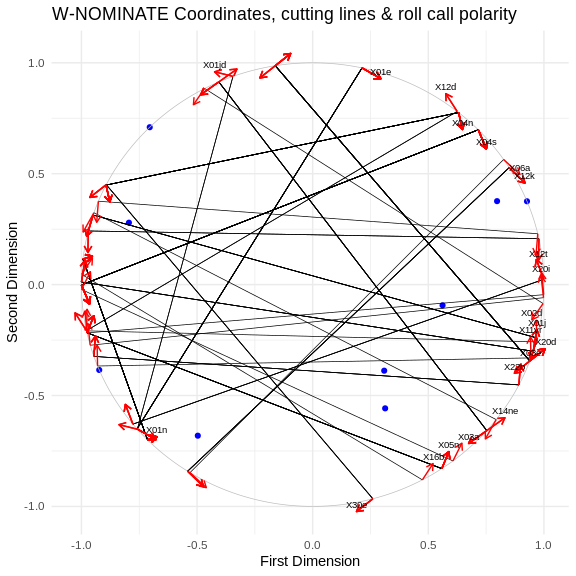
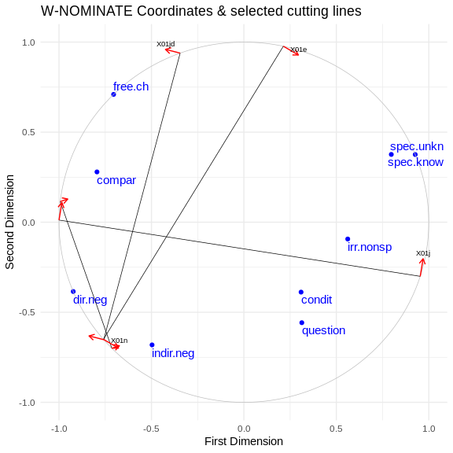
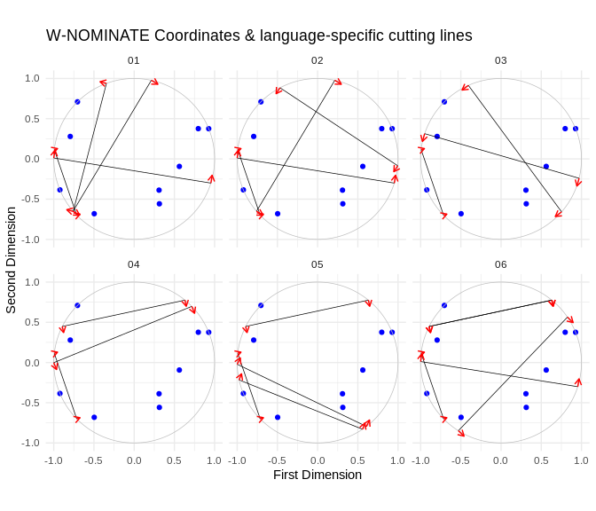
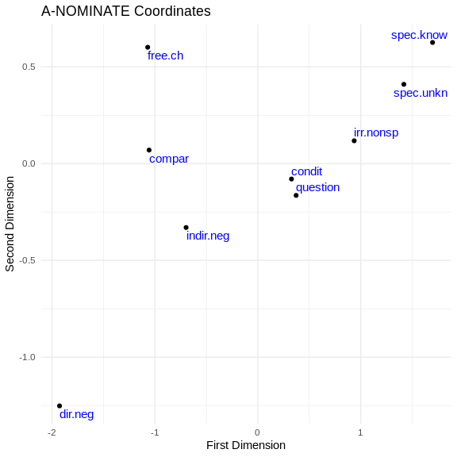
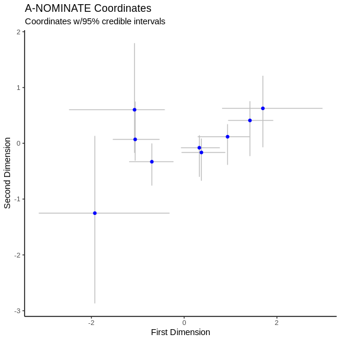

-   [Getting started](#getting-started)
    -   [Install and load required
        packages](#install-and-load-required-packages)
    -   [Load data](#load-data)
-   [Using `wnominate` & `pscl`](#using-wnominate-pscl)
    -   [Building MDS models](#building-mds-models)
    -   [Visualizing model results](#visualizing-model-results)
    -   [Cutting lines & roll call polarity via
        `wnomadds`](#cutting-lines-roll-call-polarity-via-wnomadds)
    -   [Facet cutting lines by
        language](#facet-cutting-lines-by-language)
-   [Using `anominate`](#using-anominate)
-   [References](#references)

------------------------------------------------------------------------

**An R-based guide for linguistic typologists** interested in applying
[NOMINATE](https://voteview.com/about) multidimensional scaling (MDS)
techniques to linguistic data as presented in
[Croft](http://www.unm.edu/~wcroft/) and
[Poole](https://polisci.ucsd.edu/about-our-people/faculty/faculty-directory/emeriti-faculty/poole-profile.html),
“Inferring universals from grammatical variation: multidimensional
scaling for typological analysis” (*Theoretical Linguistics* 34.1-37,
2008)."
[\[Abstract\]](https://www.degruyter.com/view/j/thli.2008.34.issue-1/thli.2008.001/thli.2008.001.xml)

This guide provides a brief summary of an R-based workflow for model
implementation and the visualization of model results within the
`ggplot` data visualization framework; a cross-linguistic data set of
indefinite pronouns from Haspelmath (1997) is utilized (and made
available) here for demonstration purposes. For more thoughtful
discussions regarding theory and scaling procedures, see reference
section.

------------------------------------------------------------------------

Getting started
---------------

### Install and load required packages

``` r
if (!require("pacman")) install.packages("pacman")
pacman::p_load(anominate, wnominate, pscl, ggplot2, knitr, devtools, ggrepel)
```

``` r
devtools::install_github("jaytimm/wnomadds")
library(wnomadds)
```

### Load data

Data set: A 9 x 140 data frame: Nine indefinite pronominal meanings,
using data from 140 pronouns in 40 languages. Data are made available
[here](https://github.com/jaytimm/mds_for_linguists_using_R/blob/master/resources/Indefprn13.txt).

``` r
local_data <- '/home/jtimm/Desktop/GitHub/git_projects/mds_for_linguists/resources'
```

Load data set:

``` r
setwd(local_data)
raw_data <- read.csv("Indefprn13.txt",
            sep="\t", 
            stringsAsFactors = FALSE)
```

A portion of the data frame is presented below. Rows contain
functions/meanings, and are analagous to legislators in the NOMINATE
model. Columns contain language-specific grammatical forms, and are
analagous to roll calls (ie, votes) in the NOMINATE model.

A value of 1 in the table below means that a given form expresses a
particular meaning; a value of 6 means that a given form does not
express that particular meaning. Missing data are specified with the
value 9.

``` r
knitr::kable(raw_data[,1:9]) 
```

| X         |  X01n|  X01e|  X01i|  X01j|  X01jd|  X02d|  X02e|  X02i|
|:----------|-----:|-----:|-----:|-----:|------:|-----:|-----:|-----:|
| spec.know |     6|     1|     6|     6|      6|     6|     6|     1|
| spec.unkn |     6|     1|     1|     6|      6|     6|     6|     1|
| irr.nonsp |     6|     1|     1|     6|      6|     1|     6|     1|
| question  |     6|     1|     1|     1|      6|     1|     1|     1|
| condit    |     6|     1|     1|     1|      6|     1|     1|     1|
| indir.neg |     6|     1|     1|     1|      1|     1|     1|     1|
| compar    |     6|     6|     1|     1|      1|     1|     1|     6|
| dir.neg   |     1|     6|     6|     6|      6|     6|     6|     6|
| free.ch   |     6|     6|     1|     6|      1|     1|     6|     6|

------------------------------------------------------------------------

Using `wnominate` & `pscl`
--------------------------

### Building MDS models

#### Rollcall object

The first step is to transform the original data structure into a
`rollcall` object using the `pscl` package.

``` r
roll_obj <- pscl::rollcall(raw_data [,-1], 
                           yea=1, 
                           nay=6, 
                           missing=9,
                           notInLegis=8,
                           vote.names = colnames(raw_data)[2:ncol(raw_data)], 
                           legis.names = raw_data[,1])
```

#### Ideal points estimation

Then we fit three models using the `wnominate` function – one-, two- &
three-dimensional solutions.

``` r
ideal_points_1D <- wnominate::wnominate (roll_obj, dims = 1, polarity=c(1)) 
ideal_points_2D <- wnominate::wnominate (roll_obj, dims = 2, polarity=c(1,2)) 
ideal_points_3D <- wnominate::wnominate (roll_obj, dims = 3, polarity=c(1,2,3)) 
```

The resulting data structures are each comprised of seven elements:

``` r
names(ideal_points_1D)
## [1] "legislators" "rollcalls"   "dimensions"  "eigenvalues" "beta"       
## [6] "weights"     "fits"
```

#### Model comparison and fitness statistics

Correct classification and fitness statistics for each model are
extracted from the `fits` element, and summarized below:

``` r
list('1D' = ideal_points_1D$fits, 
     '2D' = ideal_points_2D$fits, 
     '3D' = ideal_points_3D$fits)
## $`1D`
## correctclass1D         apre1D          gmp1D 
##      86.559998       0.539726       0.756875 
## 
## $`2D`
## correctclass1D correctclass2D         apre1D         apre2D          gmp1D 
##     86.3199997     93.1999969      0.5315068      0.7671233      0.7596588 
##          gmp2D 
##      0.8530398 
## 
## $`3D`
## correctclass1D correctclass2D correctclass3D         apre1D         apre2D 
##     85.5999985     94.8800049     95.4400024      0.5068493      0.8246576 
##         apre3D          gmp1D          gmp2D          gmp3D 
##      0.8438356      0.7662863      0.8526035      0.9352897
```

### Visualizing model results

A series of plots built using the `ggplot` data visualization framework.

#### A one-dimensional solution

Extract legislator coordinates (ie, ideal points) from one-dimensional
model results.

``` r
d1 <- cbind(label=rownames(ideal_points_1D$legislators), 
            ideal_points_1D$legislators)
d1 <- d1[order(d1$coord1D),]
```

Plot legislators (ie, grammatical functions) in one-dimensional space by
rank.

``` r
ggplot()  +
  geom_text(data = d1,
            aes(x=reorder(label, coord1D), 
                y=coord1D, 
                label=label), 
            size=4, 
            color = 'blue') +
  
#  theme_classic() +
   theme_minimal() +
  
  labs(title="1D W-NOMINATE Plot") + 
  theme(axis.text.y=element_blank(),
        axis.ticks.y=element_blank())+ 
  xlab('') + ylab('First Dimension')+
  ylim(-1.1, 1.1)+
  coord_flip()
```



#### A two-dimensional solution

We first build a simple “base” plot using legislator coordinates from
two-dimensional model results. Per `wnominate` convention, we add a unit
circle to specify model constraints. All subsequent plots are built on
this simple base plot.

``` r
base_2D <- ggplot(data = ideal_points_2D$legislators,
       aes(x=coord1D, 
           y=coord2D)) +
  
  geom_point(size= 1.5,
             color = 'blue') +
  
  annotate("path",
           x=cos(seq(0,2*pi,length.out=300)),
           y=sin(seq(0,2*pi,length.out=300)),
           color='gray',
           size = .25) +
  
  xlab('First Dimension') + 
  ylab('Second Dimension') 

base_2D + ggtitle('Two-dimensional base plot')
```



**Add** labels, a title, and change the theme.

``` r
base_2D +

  ggrepel::geom_text_repel(
    data  = ideal_points_2D$legislators,
    aes(label = rownames(ideal_points_2D$legislators)),
    direction = "y",
    hjust = 0, 
    size = 4,
    color = 'blue') +
  
  theme_classic() +
# theme_minimal() +
  
  ggtitle("W-NOMINATE Coordinates") 
```



------------------------------------------------------------------------

### Cutting lines & roll call polarity via `wnomadds`

I have developed a simple R package, `wnomadds`, that facilitates the
plotting of roll call cutting lines and roll call polarities within the
`ggplot` visualization paradigm. While `wnominate` provides
functionality for plotting cutting lines, only plotting in base R is
supported. The `wnm_get_cutlines` function extracts cutting line
coordinates from `wnominate` model results, along with coordinates
specifying the direction of majority Yea votes for a given roll call
(ie, vote polarity). Addtional details about the package are available
[here](https://github.com/jaytimm/wnomadds).

``` r
with_cuts <- wnomadds::wnm_get_cutlines(ideal_points_2D, 
                                        rollcall_obj = roll_obj, 
                                        arrow_length = 0.05)
```

A sample of the resulting data frame:

``` r
head(with_cuts)
##    Bill_Code        x_1         y_1        x_2         y_2       x_1a
## 1:      X01e  0.2133632  0.97697296 -0.7595687 -0.65042705  0.2947332
## 2:      X01j  0.9537808 -0.30050308 -0.9999306  0.01178267  0.9693951
## 3:     X01jd -0.3446922  0.93871577 -0.7581260 -0.65210812 -0.4242334
## 4:      X01n -0.7141289 -0.70001426 -0.9934111  0.11460499 -0.6733979
## 5:      X02d  0.9963522 -0.08533627 -0.4672491  0.88412571  0.9478791
## 6:      X02e  0.9537808 -0.30050308 -0.9999306  0.01178267  0.9693951
##          y_1a       x_2a       y_2a
## 1:  0.9283264 -0.6781987 -0.6990736
## 2: -0.2028175 -0.9843163  0.1094682
## 3:  0.9593875 -0.8376672 -0.6314364
## 4: -0.6860501 -0.9526802  0.1285691
## 5: -0.1585163 -0.5157222  0.8109456
## 6: -0.2028175 -0.9843163  0.1094682
```

#### Cutting lines & legislator coordinates

``` r
base_2D +

  ggrepel::geom_text_repel(
    data  = ideal_points_2D$legislators,
    aes(label = rownames(ideal_points_2D$legislators)),
    direction = "y",
    hjust = 0, 
    size = 4,
    color = 'blue') +
  
  geom_segment(data = with_cuts, 
               aes(x = x_1, y = y_1, 
                   xend = x_2, yend = y_2),
               size = .25) + #cutting start to end
  
  theme_minimal() +
  labs(title="Cutting lines & W-NOMINATE Coordinates")
```



#### Cutting lines, roll call polarity & legislator coordinates

``` r
base_2D +
  
  geom_segment(data=with_cuts, 
               aes(x = x_1, y = y_1, 
                   xend = x_2, yend = y_2),
               size = .25) + #cutting start to end
  
  ##ARROWS -- 
  geom_segment(data=with_cuts, 
               aes(x = x_2, y = y_2, 
                   xend = x_2a, yend = y_2a), 
               #cutting end to opposite arrow
               color = 'red',
               arrow = arrow(length = unit(0.2,"cm"))) +
  
  geom_segment(data=with_cuts, 
               aes(x = x_1, y = y_1, 
                   xend = x_1a, yend = y_1a), 
               #cutting start to opposite arrow
               color = 'red',
               arrow = arrow(length = unit(0.2,"cm")))+ 
  ##END ARROWS.
  
  geom_text(data=with_cuts, 
               aes(x = x_1a, y = y_1a, 
                   label = Bill_Code), 
               size=2.5, 
               nudge_y = 0.03,
               check_overlap = TRUE) +

  theme_minimal() +
  labs(title = "W-NOMINATE Coordinates, cutting lines & roll call polarity")
```



#### Selected cutting lines & legislator coordinates

``` r
selected <- c('X01e', 'X01j', 'X01jd', 'X01n')

subset_cuts <- subset(with_cuts, Bill_Code %in% selected)

base_2D +
  
  ggrepel::geom_text_repel(
    data  = ideal_points_2D$legislators,
    aes(label = rownames(ideal_points_2D$legislators)),
    direction = "y",
    hjust = 0, 
    size = 4,
    color = 'blue') +
  
  geom_segment(data=subset_cuts, 
               aes(x = x_1, y = y_1, 
                   xend = x_2, yend = y_2),
               size = .25) + #cutting start to end
  
  ##ARROWS -- 
  geom_segment(data=subset_cuts, 
               aes(x = x_2, y = y_2, 
                   xend = x_2a, yend = y_2a), 
               #cutting end to opposite arrow
               color = 'red',
               arrow = arrow(length = unit(0.2,"cm"))) +
  
  geom_segment(data=subset_cuts, 
               aes(x = x_1, y = y_1, 
                   xend = x_1a, yend = y_1a), 
               #cutting start to opposite arrow
               color = 'red',
               arrow = arrow(length = unit(0.2,"cm")))+ 
  ##END ARROWS.
  
  geom_text(data=subset_cuts, 
               aes(x = x_1a, y = y_1a, 
                   label = Bill_Code), 
               size=2.5, 
               nudge_y = 0.03,
               check_overlap = TRUE) +

  theme_minimal() +
  labs(title = "W-NOMINATE Coordinates & selected cutting lines")
```



### Facet cutting lines by language

``` r
#Extract language code from language-specific grammatical forms
with_cuts$lang <- gsub('[A-Za-z]', '', with_cuts$Bill_Code)

#Filter cutting line data set to first six language codes.
facet_cuts <- subset(with_cuts, lang %in% c('01', '02', '03', '04', '05', '06'))

base_2D +
  
  geom_segment(data=facet_cuts, 
               aes(x = x_1, y = y_1, 
                   xend = x_2, yend = y_2),
               size = .25) + #cutting start to end
  
  ##ARROWS -- 
  geom_segment(data=facet_cuts, 
               aes(x = x_2, y = y_2, 
                   xend = x_2a, yend = y_2a), 
               #cutting end to opposite arrow
               color = 'red',
               arrow = arrow(length = unit(0.2,"cm"))) +
  
  geom_segment(data=facet_cuts, 
               aes(x = x_1, y = y_1, 
                   xend = x_1a, yend = y_1a), 
               #cutting start to opposite arrow
               color = 'red',
               arrow = arrow(length = unit(0.2,"cm")))+ 
  ##END ARROWS.

  theme_minimal() +
  facet_wrap(~lang) +
  coord_fixed()+
  labs(title = "W-NOMINATE Coordinates & language-specific cutting lines")
```



------------------------------------------------------------------------

Using `anominate`
-----------------

A **Bayesian** application of NOMINATE multidimensional scaling
techniques. Model summary descriptives are based on code made available
at the [alpha-NOMINATE](http://k7moa.com/alphanominate.htm) code
repository.

<br> **Build two-dimensional anominate model**

``` r
set.seed(99)
anom_2d <- anominate::anominate(roll_obj, 
                                dims=2, 
                                polarity=c(1,2), 
                                minvotes=10,
                                lop=0.025)
```

Extract some relevant data points from `anominate` model results as data
frame.

``` r
anom_plot <- data.frame(
  label = names(summary(anom_2d$legislators[[1]])[[1]][,1]),
  coord1D = unname(summary(anom_2d$legislators[[1]])[[1]][,1]),
  coord2D = unname(summary(anom_2d$legislators[[2]])[[1]][,1]),
  
  coord1D_025 = unname(summary(anom_2d$legislators[[1]])[[2]][,1]),
  coord1D_975 = unname(summary(anom_2d$legislators[[1]])[[2]][,5]),
  coord2D_025 = unname(summary(anom_2d$legislators[[2]])[[2]][,1]),
  coord2D_975 = unname(summary(anom_2d$legislators[[2]])[[2]][,5]),
  stringsAsFactors = FALSE
  )
```

<br> **Plot two-dimensional solution**

``` r
ggplot(anom_plot, 
       aes(x=coord1D, 
           y=coord2D,
           label = label)) +
  geom_point(size= 1.5) +
  
  ggrepel::geom_text_repel(
    data  = anom_plot,
    #nudge_y =  -0.025,
    direction = "y",
    hjust = 0, 
    size = 4,
    color = 'blue') +
  
# theme_classic() +
  theme_minimal() +
  
  #xlim(-2.5, 2.5) + ylim(-1.5, 1.5) + 
  xlab('First Dimension') + 
  ylab('Second Dimension') +
  ggtitle("A-NOMINATE Coordinates") 
```



<br> **Add 95% credible intervals of legislator coordinates**

``` r
ggplot(anom_plot, 
       aes(x=coord1D, 
           y=coord2D,
           label = label)) +

  geom_segment(data = anom_plot,
               aes(x = coord1D_025, 
                   y = coord2D, 
                   xend = coord1D_975, 
                   yend = coord2D),
               color = 'gray') +
  
  geom_segment(data = anom_plot,
               aes(x = coord1D, 
                   y = coord2D_025, 
                   xend = coord1D, 
                   yend = coord2D_975),
               color = 'gray') +  

  geom_point(size= 1.5,
             color = 'blue') +
  
  theme_classic() +
# theme_minimal() +
  
  #xlim(-2.5, 2.5) + ylim(-1.5, 1.5) + 
  xlab('First Dimension') + 
  ylab('Second Dimension') +
  labs(title="A-NOMINATE Coordinates",
       subtitle = "Coordinates w/95% credible intervals")
```



------------------------------------------------------------------------

References
----------

Royce Carroll, Christopher Hare, Jeffrey B. Lewis, James Lo, Keith T.
Poole and Howard Rosenthal (2017). Alpha-NOMINATE: Ideal Point
Estimator. R package version 0.6. URL
<a href="http://k7moa.c" class="uri">http://k7moa.c</a>
om/alphanominate.htm

Croft, W., & Poole, K. T. (2008). Inferring universals from grammatical
variation: Multidimensional scaling for typological analysis.
*Theoretical linguistics*, 34(1), 1-37.

Haspelmath, M. (1997). *Indefinite pronouns*. Oxford: Clarendon Press.

Poole, K. T. (2005). *Spatial models of parliamentary voting*. Cambridge
University Press.

Keith Poole, Jeffrey Lewis, James Lo, Royce Carroll (2011). Scaling Roll
Call Votes with wnominate in R. *Journal of Statistical Software*,
42(14), 1-21. URL
<a href="http://www.jstatsoft.org/v42/i14/" class="uri">http://www.jstatsoft.org/v42/i14/</a>.
